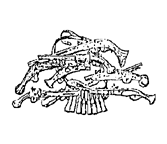

I. Purposes of the Pistol
=========================

By "Pistol" is meant any one-hand gun. This book
is concerned with two types only: (1) pistols with
revolving cylinders carrying several cartridges, and
(2) self-loading magazine pistols. For convenience,
the former will be referred to henceforth as
"revolvers" and the latter as "automatics." The
word "revolver" has long been accepted by dictionaries
in almost every language. If "automatic"
has not yet been quite so widely accepted, it is, we
think, well on the way to being so, and we shall not
be anticipating matters unduly if we continue to use
it in the sense indicated.

Excluding duelling (since it is forbidden in most
countries and appears to be declining in favour even
in those countries in which it is permitted tacitly or
otherwise), there seem to remain two primary and
quite distinct uses for the pistol. The first of those
uses is for target shooting (i.e. *deliberate* shooting
with a view to getting all shots in the ten-ring on a
stationary target). Its second use is as a weapon
of combat.

This book is concerned solely
