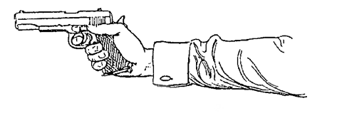

III. Training: Preliminary Course for Recruits
==============================================

The course of instruction which follows relates
primarily to the Colt automatic. The elimination
by us of any use of the side safety catch necessitates
the introduction of special features, and the system
consequently differs considerably from that in use
by the American forces, who are armed with this
particular weapon.

It might be thought that it would have been better
to have devised separate courses of instruction for
revolver and automatic respectively, but in actual
fact that would have entailed going over the same
ground twice. The methods of instruction given in
this chapter apply equally to any pistol, revolver or
automatic, if the reader will regard them from two
aspects, making a careful distinction between the
two. The first of those aspects is merely that of
the mechanics of the Colt automatic and, with suitable
modifications due to differences of design, applies
equally to any other automatic. The second relates
solely to *the method of shooting* and that, without
any modification whatever, applies equally to any
form of one-hand gun from the flint-lock onwards.
The revolver user who wishes to make use of this
chapter has only to disregard, therefore, anything
which obviously relates to the mechanics of the Colt
automatic. He will have no difficulty in doing
that.

The mechanics of the revolver are so simple and
so familiar by now to everyone that it is unnecessary,
we think, to include any description of them. We
would emphasise, however, our preferences for the
very firm grip, with the fully extended thumb, the
exclusive use of the double-action, firing in bursts,
for all short range shooting and for the single-action
at longer ranges, in circumstances which afford the
necessary time for its use. Speed with the double-action
is attainable more easily than is generally
thought, but only by training the trigger-finger by
means of continual snapping practice.

The instructor should commence by taking up a
pistol and "proving" it. This is done by removing
the magazine, working the slide back and forth
several times, and finally pulling the trigger. The
insertion of a magazine and the loading and unloading
of the pistol should then be demonstrated
and explained. Each operation is described in detail
and illustrated in the following pages. This is the
moment for the instructor to point out and give the
reason for the pinning-down, out of action, of the
safety-catch on the left-hand side of the pistol. He
should make it perfectly clear that the pistol, when
carried on service, should have a charged magazine
inserted but that *it should never be carried with a
round in the breech*. He should show that when it
is desired to fire all that has to be done is to load
in the manner described in para. 2 (c). He should
then proceed to demonstrate the extreme speed with
which it is possible to draw, load and fire by this
method, which compares more than favourably with
the alternative of drawing, pulling down the
safety-catch and firing a round already in the breech. It
should be shown, too, that the first method (with the
breech empty) eliminates the fumbling and uncertainty
inherent in the use of the safety-catch.

With this preface, all is now ready for the course
to commence.

1. One Hour's "Dry" Practice
----------------------------

a. On taking the pistol in the hand, we recommend,
   as an aid to accurate pointing, that the
   thumb be fully extended and pointing forward
   in the same plane as the pistol barrel (Fig. 1).

   Fig. 1.---The Correct Grip.

b. Stand square with the target, gripping the
   pistol now as if it weighed twenty or thirty
   pounds, pistol arm straight, rigid and across
   the body (Fig. 2). Bend the hand slightly to
   the right, to bring the pistol exactly in line
   with the vertical centre-line of the body
   (Fig. 3).
c. Raise the pistol (pistol arm still rigidly straight
   and pivoting from the shoulder), keeping it
   exactly in line with the vertical centre-line
   of the body until it covers the aiming mark
   on the target (Fig. 4). Both eyes are to be
   kept open and the recruit simply sees the
   target surrounding his pistol, making no
   attempt to look at or line up the sights, or
   to let the master-eye control the aim.
d. Immediately the aiming mark is covered, pull
   the trigger and lower the pistol to the position
   shown in Fig. 3 (the "ready" position).

Notes
^^^^^

Paragraphs (b) and (c) in conjunction with Fig. 4
reveal a deliberate attempt to eliminate *conscious*
control by the master-eye. Instead, the aim is
controlled by the combination of the square stance
and the manner of holding the pistol, *i.e.* in the
centre of the body, with the hand bent over to the
right, elements which were employed unconsciously
in the experiment on page 6.
