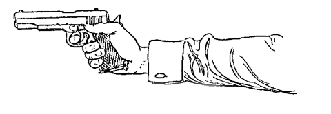
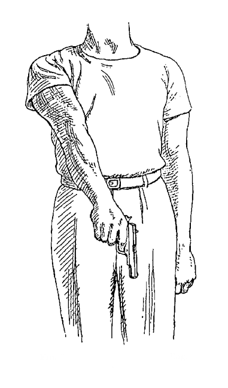
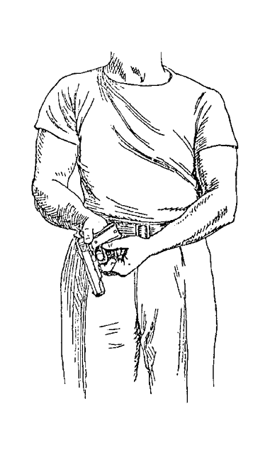

III. Training: Preliminary Course for Recruits
==============================================

The course of instruction which follows relates
primarily to the Colt automatic. The elimination
by us of any use of the side safety catch necessitates
the introduction of special features, and the system
consequently differs considerably from that in use
by the American forces, who are armed with this
particular weapon.

It might be thought that it would have been better
to have devised separate courses of instruction for
revolver and automatic respectively, but in actual
fact that would have entailed going over the same
ground twice. The methods of instruction given in
this chapter apply equally to any pistol, revolver or
automatic, if the reader will regard them from two
aspects, making a careful distinction between the
two. The first of those aspects is merely that of
the mechanics of the Colt automatic and, with suitable
modifications due to differences of design, applies
equally to any other automatic. The second relates
solely to *the method of shooting* and that, without
any modification whatever, applies equally to any
form of one-hand gun from the flint-lock onwards.
The revolver user who wishes to make use of this
chapter has only to disregard, therefore, anything
which obviously relates to the mechanics of the Colt
automatic. He will have no difficulty in doing
that.

The mechanics of the revolver are so simple and
so familiar by now to everyone that it is unnecessary,
we think, to include any description of them. We
would emphasise, however, our preferences for the
very firm grip, with the fully extended thumb, the
exclusive use of the double-action, firing in bursts,
for all short range shooting and for the single-action
at longer ranges, in circumstances which afford the
necessary time for its use. Speed with the double-action
is attainable more easily than is generally
thought, but only by training the trigger-finger by
means of continual snapping practice.

The instructor should commence by taking up a
pistol and "proving" it. This is done by removing
the magazine, working the slide back and forth
several times, and finally pulling the trigger. The
insertion of a magazine and the loading and unloading
of the pistol should then be demonstrated
and explained. Each operation is described in detail
and illustrated in the following pages. This is the
moment for the instructor to point out and give the
reason for the pinning-down, out of action, of the
safety-catch on the left-hand side of the pistol. He
should make it perfectly clear that the pistol, when
carried on service, should have a charged magazine
inserted but that *it should never be carried with a
round in the breech*. He should show that when it
is desired to fire all that has to be done is to load
in the manner described in para. 2 (c). He should
then proceed to demonstrate the extreme speed with
which it is possible to draw, load and fire by this
method, which compares more than favourably with
the alternative of drawing, pulling down the
safety-catch and firing a round already in the breech. It
should be shown, too, that the first method (with the
breech empty) eliminates the fumbling and uncertainty
inherent in the use of the safety-catch.

With this preface, all is now ready for the course
to commence.

1. One Hour's "Dry" Practice
----------------------------

a. On taking the pistol in the hand, we recommend,
   as an aid to accurate pointing, that the
   thumb be fully extended and pointing forward
   in the same plane as the pistol barrel (Fig. 1).

   Fig. 1.---The Correct Grip.

b. Stand square with the target, gripping the
   pistol now as if it weighed twenty or thirty
   pounds, pistol arm straight, rigid and across
   the body (Fig. 2). Bend the hand slightly to
   the right, to bring the pistol exactly in line
   with the vertical centre-line of the body
   (Fig. 3).
c. Raise the pistol (pistol arm still rigidly straight
   and pivoting from the shoulder), keeping it
   exactly in line with the vertical centre-line
   of the body until it covers the aiming mark
   on the target (Fig. 4). Both eyes are to be
   kept open and the recruit simply sees the
   target surrounding his pistol, making no
   attempt to look at or line up the sights, or
   to let the master-eye control the aim.
d. Immediately the aiming mark is covered, pull
   the trigger and lower the pistol to the position
   shown in Fig. 3 (the "ready" position).

Notes
^^^^^

Paragraphs (b) and (c) in conjunction with Fig. 4
reveal a deliberate attempt to eliminate *conscious*
control by the master-eye. Instead, the aim is
controlled by the combination of the square stance
and the manner of holding the pistol, *i.e.* in the
centre of the body, with the hand bent over to the
right, elements which were employed unconsciously
in the experiment on page 6. The mastery of this
combination is all that is required for effective aiming
at short range, a point which will emerge more clearly,

   Fig. 2.---Preliminary to Ready Position.

   Fig. 3.---Ready Position.

.. figure:: ../_static/ArmFullyExtended.png

   Fig. 4.---Firing, Arm Fully Extended.

perhaps, in the next chapter in discussing shooting
with the pistol held well below the line of sight.

Trembling due to the firm grip will *not* cause a
wild shot.

The trigger must be released, not by violent
pressure of the forefinger alone but by increasing
pressure of the whole hand. The combination of
the very firm grip and the pressure of the fully-extended
thumb are of great assistance in the proper
release of the trigger.

The firm grip helps also in two other ways. It
ensures smoother action in raising the pistol from
the "ready" (Fig. 3) to the firing position (Fig. 4)
and it counteracts the tendency to raise the pistol
higher than the point of aim.

2. One Hour's Practice in Safety Precautions, Loading and Unloading
-------------------------------------------------------------------

a. Demonstrate the proper ways of charging and
   uncharging magazines. To charge, press
   cartridges downwards against the forward
   end of either the magazine platform or the
   topmost cartridge, as the case may be,
   sliding the cartridge rearwards *under* the
   inwardly curving lips of the magazine. If
   cartridges are forced vertically downwards
   past these lips, the magazine cannot escape
   deformation. To uncharge, hold the magazine
   in the right hand and eject the cartridges
   one by one by pressure of the right thumb
   on their bases. The cartridges should be
   caught in the left hand and on no account
   should they be allowed to drop on the ground.
b. Hold the pistol as in Fig. 5. Insert the charged
   magazine. To make sure that it is locked
   in place, push up, with the left thumb, on
   the base plate of the magazine. Relax the
   pressure, and it will be obvious by touch
   whether the magazine is locked.
c. *To load the pistol* turn it over, as in Fig. 6,
   grasping the slide firmly with the thumb and
   forefinger of the left hand. Push forward
   with the right hand until the slide is felt to be
   open to its fullest extent (Fig. 7). Immediately
   that point is reached, release the hold with
   the left hand. The slide flies forward, taking
   with it and forcing into the breech the topmost
   cartridge of the magazine, the pistol pointing
   to the ground meanwhile (Fig 8). Turn the
   hand to the "ready" position (Fig. 3), the
   pistol being now cocked and ready for action.

   Fig. 5.---Inserting Magazine.

   Fig. 6.---First Position of Loading.

   Fig. 7.---Second Position of Loading.

   Fig. 8.---Third Position of Loading.

   Fig. 9.---Removing Magazine.

d. *To remove the magazine*, hold the pistol as in
   Fig. 9 and release the magazine by pressing
   the magazine catch with the left thumb.
   The magazine must be caught in the palm of
   the left hand and should then be restored to
   pouch or pocket, as the case may be, or
   handed to the instructor if the latter so
   directs. The pistol meanwhile *must* be kept
   pointing to the ground, since it is still cocked
   and has a live round in the breech. The
   magazine being disposed of, turn the pistol
   with the wrist into the position of Fig. 10, and
   eject the live round by pulling back the slide
   with the finger and thumb of the left hand
   (with a little practice the live round can be
   saved from damage by catching it in the
   left hand as it is ejected). Work the slide
   back and forth a few times, as an added
   measure of safety, and pull the trigger, the
   pistol pointing all the while to the ground.
e. *Dismounting the pistol for cleaning*. A knowledge
   of how to dismount the pistol, as far
   as is necessary for cleaning and of assembling
   it subsequently, is essential, and this is a
   convenient stage in the proceedings at which
   to teach it. It provides also a good
   opportunity to impress on the recruit the
   necessity for *always* treating a pistol as
   loaded until proved otherwise. Before he
   is allowed to place his pistol on the bench
   on which it is to be dismounted, the weapon
   is to be "proved" by removing the magazine,
   working the slide back and forth several
   times and pulling the trigger, the pistol
   being held as shown in Figs. 9 and 10.

Note
^^^^

"Dummy" ammunition should be used throughout
this practice.

   Fig. 10.---Working the Slide.

3. Initial Firing Practice
--------------------------

a. The target should be white, not less than
   8 feet square and should have in the middle
   a life-size outline of a man, full view (Fig. 11).
   The recruit is to stand not more than 2 yards
   away from this target. The size of the target
   and the distance at which the recruit is to
   fire need explanation. The combination of
   these two factors renders it almost impossible
   for even the most awkward beginner to score
   a clean miss. With every shot registered,
   the instructor sees plainly what fault had
   been committed and is at once able to
   correct it. The recruit experiences pleasurable
   surprise that even he is able to hit the
   target, and that is a much better beginning
   to his training than the mortification of
   missing a small target altogether, without
   knowing in the least where his shot has
   gone. In short, by the use of these methods
   the instructor has far less trouble, the recruit
   gains confidence, and whoever has to pay
   for it is saved a whole lot of ammunition.
b. Target and distance as above, the recruit is
   given six cartridges. After charging his
   magazine, inserting it in the pistol and
   putting on round in the breech, all as
   described in para. 2 (sections (*a*), (*b*) and
   (*c*)), the recruit stands at the "ready"
   position.

He should then be told to keep both eyes open,
concentrate his gaze on the centre of the figure

   Fig. 11.---Recruits' Target.

target, bring the pistol up quickly and, as described
in para. 1 (sections (*c*), and (*d*)), fire immediately it
covers that point of the target of which his eyes
are focussed, returning subsequently to the "ready"
position without delay. Repeat until the recruit has
fired four out of his six shots. The last two shots
should be fired as a "burst," *i.e.* in succession and
as rapidly as the recruit can manage. He should
remain afterwards in the firing position until
told by the instructor to lower his arm to the
"ready."

Notes
^^^^^

This practice should not be hurried. The first
four shots,

.. figure:: ../_static/.png

   Fig. .---.

