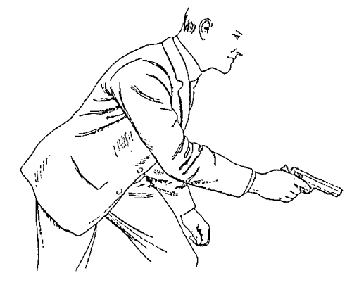
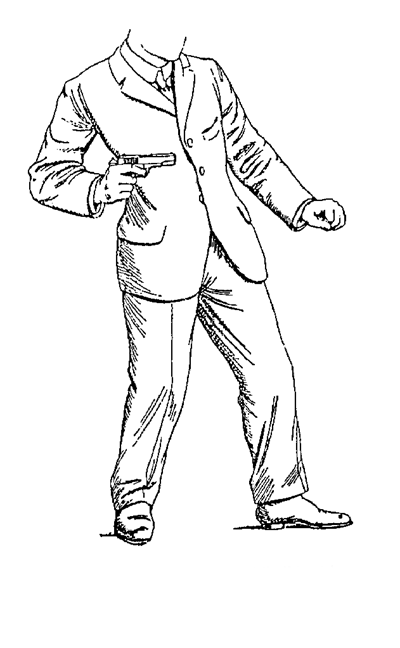
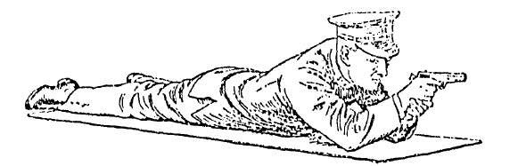
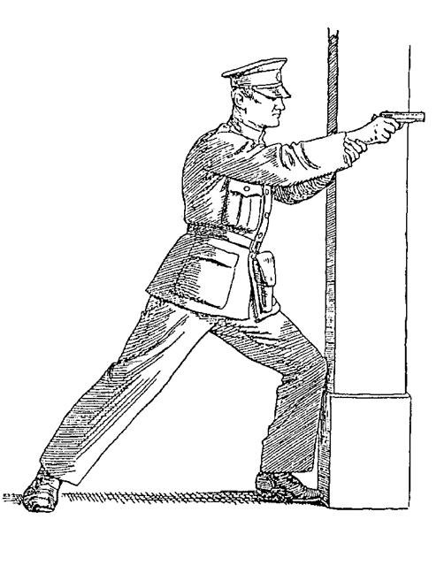
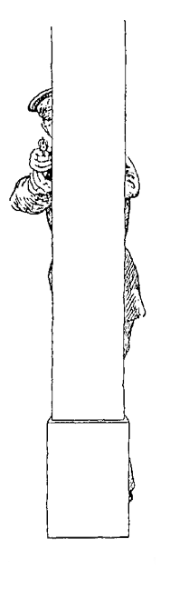

IV. Training: Advanced Methods
==============================

Chapter III has taken care of all the stages of the
recruit's preliminary training, but before he is
turned loose on the world as qualified to use a pistol
there is one more thing for him to learn. This is
shooting from what, for want of a better term, we
call the "three-quarter hip" position illustrated in
Fig. 12.

This position is designed to meet a condition
referred to in the first chapter when describing the
circumstances under which shooting affrays are likely
to take place. We indicate there that in moments
of stress and haste men are apt to fire with a bent arm.

Examination of the illustration shows exactly this
position. Closer examination shows also that the
firer is facing his adversary squarely, has one foot
forward (it does not matter which), and that he is
crouching slightly.

From this position, pistol hand in the vertical
centre-line of the body and hand bent to the right
as before, the recruit fires a burst of two or three
shots, but *quickly*, at a distance of 3 yards. If he
succeeds in making nothing worse than a 6-inch
group, he shoul repeat the practice at 4 yards.

The instructor should make a special point of
explaining all the elements of this practice. The bent
arm position is used because that would be instinctive
at close quarters in a hurry. The square stance, with
one foot forward, is precisely the attitude in which
the recruit is most likely to be if he had to fire
suddenly while he was on the move.

   Fig. 12.---"Three-quarter Hip" Position.

The "crouch,"
besides being instinctive when expecting to be fired
at, merits a little further explanation.

Its introduction int this training system originates
from an incident which took place in 1927. A
raiding party of fifteen men, operating before
daybreak, had to force an entrance to a house occupied
by a gang of criminals. The only approach to the
house was through a particularly narrow alley, and
it was expected momentarily that the criminals would
open fire. On returning down the alley in daylight
after the raid was over, the men encountered, much
to their surprise, a series of stout wires stretched at
intervals across the alley at about face height.
The entire party had to duck to get under the wires,
but no one had any recollection of either stooping
under or running into them when approaching the
house in the darkness. Enquiries were made at once,
only to reveal that the wires had been there over a
week and that they were used for the wholly innocent
purpose of hanging up newly dyed skeins of wool to
dry. The enquiries did not, therefore, confirm the
suspicions that had been aroused, but they did serve
to demonstrate conclusively and usefully that every
single man of the raiding party, when momentarily
expecting to be fired at, must have crouched considerably
in the first swift traverse of the alley. Since
that time, men trained in the methods of this book
have not only been permitted to crouch but have
been encouraged to do so.

The qualification we require before the recruit's
course can be successfully passed is 50 per cent. of
hits anywhere on the man-sized targets employed.
Time has shown this to be adequate for the purpose
in view.

We indicate elsewhere our aversion to trophies,
badges, etc. No "expert's" or "marksman's"
badges are issued to men who pass our recruit or
other courses, no matter how much in excess of
50 per cent. their scores may have been. If a man
makes "possibles" throughout, his only reward is
the resultant confidence in himself and the satisfaction
of knowing that if he has to "shoot it out" with a
pistol he will be a better man than his opponent.

Similarly, we have a dislike of "team shoots."
We feel that the ammunition would be much more
usefully employed in giving additional practice under
instruction.

|

From now on, in proceeding to more advanced
training, the use of stationary targets should be
abandoned in favour of surprise targets of all kinds
and in frequently varied positions. Such targets
would include charging, retreating, bobbing, and
traversing figures of man-size. Traversing targets
can be either at right or oblique angles. Musketry
officers will have no difficulty in devising for themselves
endless variations on this theme, and current
incidents, more especially in the nature of actual
happenings to men of their particular service, often
provide valuable suggestions.

We will give on example of a practice which has
been frequently carried out with good results. It is
designed not only as a test of skill with the pistol
under difficult conditions, but also a test of bodily
fitness and agility, qualities which to the policeman
at any rate are every bit as necessary in the circumstances
which are so often encountered in shooting
affrays.

In this practice, which we have called the "Pursuit,"
the shooter is started off at the run, outside
the range, on an obstacle course consisting of jumping
a ditch, running across a plank over water,
crawling through a suspended barrel, climbing a
rope, a ladder, and over a wall, finishing up with a
100 yards dash ending at 4 yards from the targets.
Without warning or waiting, two surprise targets are
pulled, one after the other, and at each he fires a
"burst" of three shots. The targets are exposed for
no longer than it takes to fire three shots at the
highest possible speed.

Yet another practice, a "mystery shoot," is
described in the chapter entitled "A Practical Pistol
Range."

In all practices at surprise targets, opportunity
must be found for the performance of two very
essential operations. In order of importance, these
are:---

1. Making safe after firing only a portion of the
   contents of the magazine.
2. Inserting a second magazine after totally
   expending the contents of the first and
   continuing to fire without delay.

In the first instance, after firing one or two shots
from a fully charged magazine, the instructor should
give the order to cease fire. The shooter should
then come to the "ready," remove the magazine,
eject the live round from the breech, work the slide
back and forth several times and finally pull the
trigger, all as described on pp. 25 and 31 (Figs. 9 and
10).

In the second instance, immediately the last shot
has been fired, the shooter comes to the "ready,"
removes the empty magazine, inserts a fresh one and
reloads, either by pressing down the slide release stop
with the thumb of the left hand or by slightly retracting
and then releasing the slide. The slide flies forward,
taking a cartridge into the breech, and the shooter
resumes the "ready" position by bending his hand to
the right and awaits the appearance of the next target.

Practice at surprise targets can be carried out first
with the arm fully extended and later from the
"three-quarter" hip position. There are still two
other methods of close-quarter shooting to be
described, but before doing so this will be perhaps an
opportune moment to call the attention of instructors
to several points which will be of assistance in getting
results.

When firing at surprise targets, never let men
anticipate matters by standing in the firing position.
They must be standing at the "ready" before the
first target appears. If the succeeding targets are
pulled with no perceptible interval, the men may
continue to stand in the firing position. Otherwise
they should come down to the "ready" again after
each shot or "burst" while awaiting the appearance
of the next target.

Attention has been drawn already to the necessity
for the square stance. When turning from one target
to another the square stance must be preserved by
turning the body. This can be effected by scraping
the feet round or even jumping round if the extent
of the turn warrants it. It does not matter how it
is done so long as the firer faces each fresh target
squarely and is thus enabled to retain the pistol in
its original position, *i.e.* in alignment with the
vertical centre-line of the body.

In firing at a crossing target ("running man"), it
will soon be observed that 90 per cent. of all the
misses are traceable to firing ahead of it or, as a
man accustomed to the shot-gun would say, to
"leading it." This holds good even when the range
is only 4 yards and the target only travels at about
3 miles an hour. This is not the place for a controversy
over the rival merits of "leading" a moving
target or "swinging" with it. Or purpose is merely
to assist instructors in correcting their pupils'
mistakes, and we content ourselves with pointing
out that, distance and speed of target being as
stated, a bullet travelling at eight hundred feet a
second would strike only about three-quarters of an
inch behind the point of aim.

We now turn to the two other methods of close-quarters
shooting previously referred to. These are,
respectively:---

   Fig. 13.---"Half-Hip" Position.

   Fig. 14.---"Quarter" or "Close-Hip" Position.

Apart from shortening the arm by bringing the elbow
to the side, the "half-hip" is no different from the
"three-quarter," and should be practised at not
more than 3 yards. Above that distance it would
be more natural to shoot from the "three-quarter"
position.

The "quarter" or "close-hip" position is for
purely defensive purposes and would be used only
when the requirements are a very quick draw, followed
by an equally quick shot at extremely close quarters,
such as would be the case if a dangerous adversary
were threatening to strike or grapple with you.
Practice this at 1 yard. This is the only position in
which the hand is not in the centre of the body.

Before we close the subject of shooting at short
ranges, we would ask the reader to keep in mind that
if he gets his shot off first, no matter whether it is a
hit or a miss by a narrow margin, he will have an
advantage of sometimes as much as two seconds
over his opponent. The opponent will want time to
recover his wits, and his shooting will not be as
accurate as it might be.

It will be appropriate now to turn our attention
to training ourselves for shooting at longer ranges,
for in spite of having said that the great majority
of shooting affrays take place within a distance of
4 yards, the need does arise occasionally for a
long shot.

For a long shot in the standing position, we think
the two-handed methods shown in Figs. 15 and 15a
are best calculated to produce results.

   Fig. 15.---Two-Handed, Standing.

The right
arm is rigid and is supported by the left. Practise
at any reasonable distance from 10 yards upwards.

   Fig. 15a.---Two-Handed, Standing.

Fig. 15 shows the proper method to employ if you
have to shoot from the prone position (Fig. 16).
Incidentally, do not be afraid to adopt this position
immediately if circumstances demand it, as might
be the case if you had to deal with several adversaries
simultaneously. Practice yourself in getting quickly
into the prone position, remembering that it gives
you the dual advantage of being able to do your
shooting from a steady position at a mark which is
against the sky-line, as it were, while you yourself
offer a less conspicuous target for your opponents
than if you were standing up.

   Fig. 16.---Two-Handed, Prone.

   Fig. 17.---Side View.

Kind providence had endowed us all with a lively
sense of self-preservation and some of us with a sense
of strategy as well. If our readers are in the latter
class we need not remind them of the advantages
of taking cover whenever possible. It is possible, however
that some of you have not thought of a telephone
pole or electric light standard in that connection.
Fig. 17 will show you a side view of how to do it most
conveniently, and Fig. 18 shows how an adversary
will view the matter. Note in the former illustration
the position of the feet, knees and left forearm.
The left knee and forearm are pressed against the
pole, left hand is grasping the right wrist, thumb of
the right hand resting against
the pole. Fig. 18 also demonstrates
the almost perfect cover
provided.

   Fig. 18.---Front View.

If the long shot gives you
enough time to be deliberate,
so much the better, because the
two-handed position and that
of Fig. 17 permit of almost rifle-like
accuracy. But do not take
it for granted that you will
have time to deliberate. It
is wiser to assume that you will
not, and it will be to your
advantage, therefore, to practise
all three of the two-handed
methods at the same surprise
targets as are used for short-range
work.

We have condemned the use
of sights for all forms of short-range
shooting, but for long
shots, such as we have been
describing, sights offer a distinct
advantage. We have little faith,
however, in those usually furnished.
Good as some of them
are for use against a white
target and a black bull's eye,
there are a very few that can
be picked up instantly against a dark background,
and this difficulty is increased to the point of
being insuperable if the light is bad. To overcome
this, the authors' personal pistols are fitted
with foresights of silver, of exactly the shape
of the ordinary shot-gun bead and about the same
size. If kept bright, these sights collect any light
there is from any angle and can be seen instantly in
all circumstances except pitch-darkness. They stand
up very well to rough work and can be easily replaced
if damaged. We see no reason against the adoption
of this type for service issue if some suitable white-metal
alloy were used instead of silver. Though not
claimed as suitable for target work, these sights
answer their purpose admirably where speed is the
prime consideration.

The best rear-sight for use in conjunction with the
silver bead is a wide and shallow "V." The rear-sight
should be affixed with a distinct slope to the
rear, and once the gun is sighted-in, should be kept
in place with a small set-screw. It will not shoot
loose then and will be less liable to displacement or
loss by accident or ill-usage.
