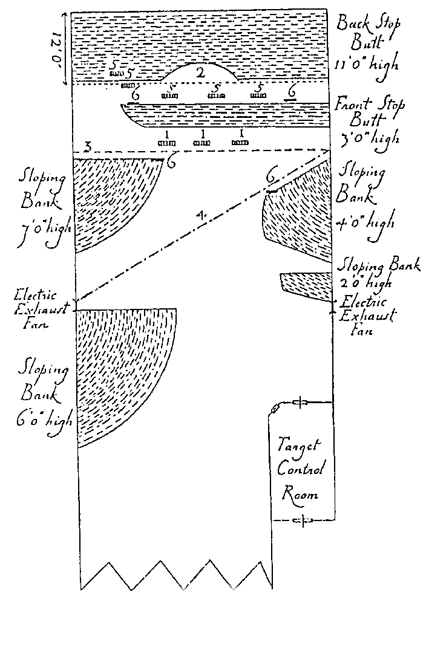

VI. Practical Pistol Ranges
===========================

Doubtless most of us would prefer to do our pistol
shooting out of doors. There is the pleasure of being
in the fresh air, there are no powder fumes to contend
with, and the noise is less trying than in an indoor
range, where so many men find it necessary to plug
their ears.

Apart, however, from these considerations, the
value of an outdoor range is limited. It can only be
used in daylight and in good weather. Further,
though it may be a minor point, the equipment of
an outdoor range is liable to deteriorate more rapidly
than it would indoors. Influenced by the necessity
to conduct pistol training regardless of weather and
frequently after dark, our preference is for the
indoor range. It gives us in addition greater facilities
than would be reasonably possible out of doors for
varying the lighting at will. We have in mind
training courses which endeavour to reproduce as
closely as possible the conditions which police the
world over so often encounter in the course of duty.
Criminals favour darkness or semi-darkness for the
exercise of their talents, and a large proportion of the
shooting affrays in which police are concerned take
place under precisely those conditions. We venture
to suggest that every man who has to use a pistol
in the course of duty should learn how to do so in
the dark. It *can* be done, it is often necessary, and
the acquisition of confidence in this respect is
invaluable.

If circumstances dictate an outdoor range, select,
if you can, a piece of ground on which a high bank or
a hillside provides a natural stop butt. A disused
quarry or gravel-pit usually answers the purpose
admirably. If the only ground available is flat, the
stop butt is best constructed of a steeply sloping
bank of earth backed by a wall of brick, stone,
concrete or heavy timber.

Reference to the plan (Fig. 19) of an indoor range
will show the lay-out we suggest. The contents of the
next paragraph apply equally to outdoor and indoor
ranges.

   Fig. 19.

*Explanation---*

1. Frames for three bobbing targets, full figure.
2. Track and frame for running target, half figure.
3. Track and frame for running target, full figure.
4. Track and frame for running target, full figure.
5. Frames for five bobbing targets, half-figure.
6. Frames for four disappearing targets, head and shoulder.

Every precaution must be taken against ricochets.
The earth of which the stop butt is built up must be
thoroughly sifted to ensure the removal of all stones,
large and small. It is a good plan to face the sloping
front of the stop butt with turf. Every scrap of
metal used in the construction and which is liable to
be struck by bullets from the firing point must be
thoroughly protected by earth or soft wood. At
intervals, depending on the amount of shooting, the
stop butt should be raked and dug over in order to
remove all expended bullets. These do not penetrate
very far in any case, and continued firing concentrated
on particular spots tends to bring them
to the surface. Their removal should not be deferred
too long, for being close to the surface of the bank
and most likely in agglomerations of many bullets
together, they constitute a definite cause of ricochets.
And no one can ever foretell the course (or force) of
a ricochet. The sale of the metal recovered in this
manner often helps materially to reduce the running
costs of a range. Prudence suggests that both the site
and the plans of construction should be approved
by the competent local authority before any work
is undertaken, and doubtless that authority will
insist on an examination of the completed range
before firing is permitted.

Reverting to the plan, we draw attention to one
feature that may be unusual and to another that
certainly is. The former is the Control Room, and
the latter is the absence of any fixed firing point.

The control room houses the men who operate
the targets. It provides them with perfect safety
while firing is in progress, and from it they emerge
at intervals to patch the targets. But they do not
emerge until the Range Officer switches on a green
light which shows high over the targets and is visible
to them. A red light is shown in the same place
while firing is actually in progress or about to take
place.

As stated, there is no fixed firing point nor is there
any barrier across the range. The range is not
divided into longitudinal sections, with booths for
individual shooters at the firing end. Such devices
would be impracticable for the training system
which we advocate, and this will be clear if we add
that we have to make provision for such widely
differing demands as two-handed shooting at 25 yards,
hip shooting at practically point-blank range, and
practices which entail running at full speed a certain
distance down the range in order to fire at several
suddenly appearing moving targets. Obviously there
is only room for one man at a time to shoot in safety
under such conditions. The only time when this
rule is permitted to be broken is in the initial recruit
practices at stationary targets, when three men may
sometimes shoot side by side, under the watchful
eye of the instructor. It might be inferred from the
fact that, with the one exception mentioned, only
one man at a time can shoot, the proceedings would
be unduly slow. In actual practice, however, the
range illustrated and the system described have
shown their capacity for a number of years to take
care of the training and practice requirements of a
force of 6000 men, or, if we include auxiliaries who
also have to be trained, nearly 9000 men.

Freeing the range from all the obstacles that would
be constituted by fixed firing points also permits the
staging on occasion of what we are pleased to call
"mystery shoots." On these occasions the range,
except for the targets, is transformed beyond all
recognition, and it is astonishing what can be done
in this respect in a building of very modest dimensions.
To give an idea of what we mean, the range
on Fig. 19 has more than once been made to represent
the interior of a Chinese lodging-house harbouring,
among other inmates, half a dozen bad characters
who will resist arrest.

A screen hides all this from the men who are going
to shoot. All they see from the outside is a wall
with a door, through which, one by one, they will
have to enter the lodging-house. No one knows
what he will encounter inside, and the only
instructions given are that innocent civilians are not
to be "killed," such action being likely to impede
promotion. The first man to shoot pushes in the
door, closely followed by the range officer, and proceeds
with caution or with reckless abandon, according to
his nature, along a dark, narrow, twisting passage,
kicks open a door at one point, descends a few
steps, treads on floor-boards which give way under
him, climbs some more steps and finds himself in a
dimly lit room occupied by apparently harmless
people (dummies) who vary from mere lodgers to
dope fiends or stool-pigeons. He has to take in the
situation in a flash, for his appearance is the signal
for the fun to commence. A shot is fired at him
(blank cartridge in the control room), and the
criminals commence their "get-away" ("criminals"
are life-size targets that bob up from nowhere and
disappear as quickly, heads and shoulders that peer
at him briefly round a corner, men running swiftly
across the room, possibly at an oblique angle, etc.,
all masked at some point in their careers by the
"innocent bystanders," who must not be shot).
There is no time to think, and anything resembling
deliberate aim is a sheer impossibility. Furniture
and dummies impede his movements, and it is
noticeable that he instinctively adopts the "crouch"
and shoots as a rule with the arm in any position
except fully extended. His only course is to shoot
quickly and keep on shooting till his magazine is
empty, hoping that he is hitting the "criminals"
and not the dummies. Any ill-luck as regards the
latter is rewarded, when the results are announced,
by precisely the sort of comment that might be
expected from the crowd.

This sort of thing is not mere play-acting. It is
done with the sole purpose of making practice as
realistic as possible and of stimulating interest. If
the men are kept indefinitely at the same dull routine
they *will* lose interest, and results suffer accordingly.

We should add now that the expenses of these
productions are negligible if there are available a
little imagination, a lot of willing help, some wood
battens, straw, old clothes and hessian or old sacking.
The steps referred to are easily arranged by having a
pit in the floor, keeping it covered over when not
required. The loose flooring only requires a very
simple bit of mechanism, worked from the control
room, to make it give way slightly when walked on.

Targets, always life-size, are drawn or printed on
the cheapest paper and pasted on to a backing of
hessian, old cloth or canvas; any thing will do. This
backing is tacked on to frames which are slid into
trolleys, or hung on wires which are designed to
provide the runners, bobbers, charging men, etc.
to which reference has been made. These devices are
all very simple and only need a little ingenuity to
work out for any requirements. The target frames
do not merit anything but the cheapest wood and
roughest workmanship since they very quickly get
shot to pieces.

Special attention must be given to the ventilation
of the range, and there cannot well be too many
exhaust-fans to carry away the powder fumes.
Continued exposure to powder fumes is liable to
produce an affection of the eyes which is in all
respects similar to and indeed difficult to distinguish
from conjunctivitis ("pink-eye"). The persons
most liable to suffer from this complaint are the
control room operators who spend much of their
time in patching targets, and that is just where the
fumes collect most thickly when firing at the very
short distances which we advocate. The first signs
of any inflammation of the eyes should be the signal
to re-examine the ventilating system of the range.

We have found that the most practical flooring
for the range is beaten earth. We think, too, that
an earthen floor helps to reduce noise, which of
course is considerable more in an indoor than an
outdoor range. Noise can be reduced further by the
use of millboard on the sides of the building and by
curtains suspended from the roof or coiling. The
matter is largely one of experiment, and experiments
in this direction are likely to be well worth the trouble
involved.
