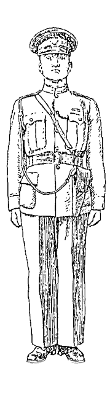
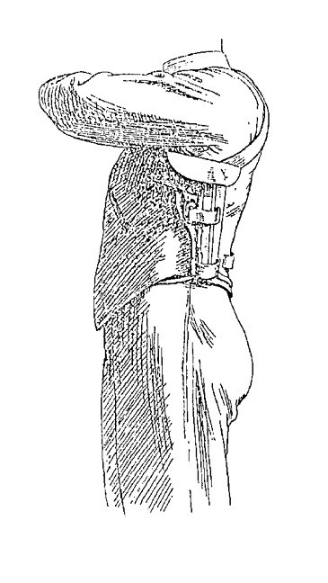
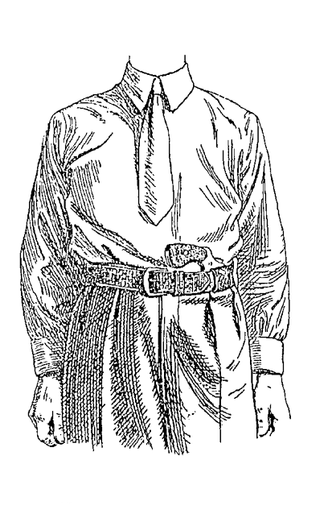
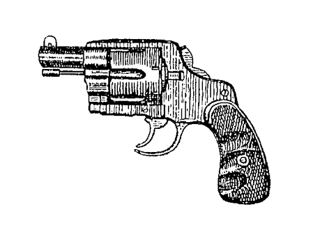

VIII. Miscellaneous
===================

- Holsters.
- Care and Cleaning of Pistols.

Holsters for service men who are required to carry
a pistol openly while in uniform must obviously be
of a standard pattern, and there is little room for all
the refinements that to to the making of a really good
holster where individual requirements are the only
consideration.

Nevertheless, the design of service holsters might
well be given a little more thought than is often the
case. It is not possible, perhaps, to combine service
needs with the facilities for the lightning-quick draw
which some special designs provide, but there are
one or two things that can be done to help in the
latter respect. The butt of the pistol should protrude
from the holster sufficiently to allow the user to get
it well into his hand as quickly as possible; there
should be no fumbling. If there is, there is something
radically wrong with the design. The front of the
holster should be cut away to allow the forefinger
to enter the trigger-guard without resistance and
without the stubbing of the finger-nail on the leather
that is so often noticed. The gun can be secured in
the holster either by a flap or a strap, both fastening
on a metal stud. The strap is, of course, no wider
than it must be to effect its
purpose. The flap offers better
protection from the weather,
and we do not think its greater
width makes any real difference
to the speed with which the
pistol can be drawn. The
bottom of the holster should
be open so that is case of rain
or accidental immersion the
water does not remain inside
and the holster can dry out
more quickly. The bottom of
the holster cannot be entirely
open if the design of the pistol
is such that it will slip too far
down, but it is always possible
to leave an aperture or apertures
of adequate size for
draining.

   Fig. 20.

There remains to be considered
the position in which
the holster should be worn.
The writers have a preference
for wearing the gun on the
belt at the left side of the
body. In that position (see
Fig. 20) the wearer is able to
draw his pistol at reasonable
speed, and apart from those
occasions when he is obliged to shoot, he can
protect it with his left hand and forearm from
attempts to snatch it from the holster. Policemen
find that such attempts are by no means infrequent
in a crowd or on the part of "drunks"
resisting arrest. To guard further against this
danger (and it may well be serious), we recommend
the use of a stout lanyard attached at one
end to the swivel in the pistol butt. The other end
should pass in a loop over the right shoulder, the
shoulder strap of the uniform preventing the lanyard
from slipping off. Never wear the lanyard round the
neck, as we have sometimes seen it done, for needless
to say, such a practice is liable to add to the danger
very considerably.

Whatever the position in which the holster is worn,
great care should be taken to ensure that its design
and method of attachment to the belt provide the
maximum of resistance when the pistol is drawn. To
make our meaning clearer, the pistol should slip
easily out of the holster, but the holster itself should
remain as nearly immovable as possible. Otherwise,
when the pistol is drawn, the holster has a tendency to
accompany it, and the result is a slow and clumsy
draw. With a holster worn on the right thigh, the
necessary amount of resistance may have to be
provided by a thong or string fastened to the bottom
of the holster and tied round the leg. Though so far
we have been referring solely to holsters to be worn
openly when in uniform, it will be obvious that the
necessity for resistance exists for all other holsters
as well.

Turning now to holsters for other purposes, we
strongly recommend the reader to be satisfied only
with the best and to take any amount of trouble in
order to get it.

Having provided yourself with the pistol of your
choice, consider next how it will suit you best to
carry it. Determine whether it is to be carried openly
or concealed on the person. If the latter, do you
prefer it under the left arm (Figs. 21 and 21a)
or around the waist (see Figs. 22, 22a, 22b)?
Having decided these points, get in touch with one
of the reliable and well-known makers of holsters.
If unable to visit him personally, provide him with
such information as is appropriate to your requirements.
Depending on those requirements, such
information might well consist of

- The make and model of the pistol.
- Your chest, waist and shoulder measurements.
- Length of arm.
- Size of hand and length and thickness of
  trigger-finger.
- A photograph of yourself, showing the clothes
  usually worn.

   Fig. 21.---Shoulder Holster.

   Fig. 21a.---Shoulder Holster.

   Fig. 22.---Belt-Holster and Pistol.

.. figure:: ../_static/BeltHolsterAndPistolA.png

   Fig. 22a.---Belt-Holster and Pistol.

   Fig. 22b.---Cut-down Revolver.

With these particulars in his possession, the
maker will be able to design a holster suited to your
requirements in every way, including the correct
angle at which to wear it. This latter is a most
important aid to a quick draw. Though the foregoing
may appear to the uninitiated as unduly
meticulous, if not altogether too "finicky," it is
only in this way that you will be able to get the
utmost out of the pistol of your choice. That, we
presume, is you object, and that to attain it you will
be prepared to go to the necessary trouble and expense.

Supposing now that you have obtained a good
holster, do not put it away and forget it. Mere
possession is not sufficient. The best holster ever
made will not make you any quicker on the draw
without practice, and plenty of it. Nothing can excel
"dry" practice in front of a mirror, and a friend
with a stop-watch can often help you materially.

Though it is a safe general rule to seek the assistance
of a manufacturer of repute, we should be the
first to admit that there are plenty of other ingenious
people capable of thinking out, designing and even
making extremely effective holsters for themselves.
One of the fastest holsters we have ever seen was
designed and made by an amateur for use when on
motor-cycle patrol. Fashioned from a cut-down
service holster and fastened on with pieces of string,
the finished product was not a thing of beauty,
but it was 100 per cent. practical. It hung slightly
below his belt in the centre of his body and enabled
him to drop his hand a few inches from the handle-bar
of the cycle on to the butt of the gun with
complete certainty and lightning speed. Moreover,
the holster held the gun securely even when riding
over very rough ground. Here is a case of a man
who not only had sufficient ingenuity to make a
holster which exactly met his particular requirements,
but sufficient application to perfect himself in its
use by assiduous "dry" practice.

Another instance of ingenuity on the part of an
amateur, though it relates more nearly to a "gadget"
than a holster, was furnished by a doctor whom one
of the authors met in San Diego. This device was
intended to cope with a "hold-up" when driving
his motor-car. A slight flick of his hands and the
next instant the doctor was grasping a pair of
.38 revolvers, all ready for instant action. The
observer's impression was that the guns appeared
from nowhere, and far too quickly to enable one to
get any idea how it was done. Had the doctor been
actually held up at the moment, it is more than likely
that his assailant would have been completely beaten
by the utter unexpectedness of the thing.

We should not attempt to describe the device
even if we could. It is sufficient to say that it was
the result of many weeks of planning, adjustment
and "dry" practice, all of which the doctor found
to be "well worth the trouble, and great fun besides."

On the same day, the author referred to was
privileged to watch the Martin Brothers at quick-draw
work with their famous front-draw holsters, one
strapped down on each thigh, and he left firmly
convinced that San Diego would be a very good
town for bad men to keep away from.

In one respect the pistol resembles the automobile
engine or other piece of machinery in that it should
be "run-in" and subsequently "tuned-up" to
remove any small defects and asperities. This
applies with greater force to automatics, and in their
case the "running-in" process may well consist of
fifty rounds of rapid fire. If all bearing-parts are
then smoothed up by an armourer who knows his
business, the pistols will not only be pleasanter to
shoot with but will last much longer.

Where a number of men are engaged in cleaning
their pistols at the same time, care must be taken
that all parts which have been dismounted are
reassembled on the right pistols. To this end, it is
of great advantage if such parts are all stamped plainly
with the numbers borne by the respective pistols to
which they belong. This also ensures that pistols
are correctly reassembled by the armourers after a
general overhaul.

Cleaning in these days is a simple matter. Provide
yourself with a celluloid-covered cleaning rod, the
tip threaded to receive any of the following
implements---a brass wire brush, a slotted jag, and a
bristle brush. Provide yourself also with an aqueous
solvent (of the nature of "Chloroil" or Young's
.303 Cleaner), some flannelette patches and a tube
of gun grease.

If the pistol permits of it, dismantle it, to facilitate
the cleaning of the barrel. Attach the brass wire
brush to the rod, dip it into the solvent, and run it
through the barrel several times to loosen the fouling,
and more particularly, if your ammunition has the
older type of primer, to remove the potassium
chloride which in that case will have been deposited.
Then, using the slotted jag, run through several
patches soaked with the solvent, finishing with one
or two dry patches. The last dry patch should bear
no traces of fouling. Finish with an application of
the gun grease on the bristle brush. There should be
no more grease than is necessary to coat the inside
of the barrel with a *very light film* and *neither breech
nor muzzle should be choked or clogged up*. If care is
exercised in these respects, the pistol may be fired
subsequently without having to wipe the barrel
out first.

Whenever the design of the pistol permits it,
always clean the barrel from the breech end.

All the foregoing remarks apply to barrels of
automatic pistols and barrels and cylinders of
revolvers.

Incidentally, nickel fouling due to jacketed bullets
does not appear to exist. If it does, it is so slight
as to be of no account.

The major part of the task is now finished. For
the rest, wipe over with a slightly greasy rag all other
metal parts, paying particular attention to the
breech face, and in the case of revolvers to the other
parts where fouling is apt to collect.

If the pistol is to be put away for any length of
time, wipe dry and clean all metal parts other than
the barrel (which has been attended to already),
apply a film of gun grease (most easily done with the
bristle brush) and wrap in greaseproof paper, making
sure that you do not leave finger-marks on the
metal. A pistol treated in this manner and put away
in its box or case, if you have one, may be stored for
a long time without attention. Never store in a
holster; the leather is susceptible to damp and will
cause rusting of all metal in contact with it.

We do not favour the use of oil. If it is too thin
it is not a good preservative, and if it is too thick it
is liable to become gummy, to the detriment of
moving parts. Almost invariably, too, its use is
overdone, with the result that the pistol overflows
with oil which cannot all be removed before firing.
Firing, and more particularly rapid firing, is apt to
cause the user to be bespattered with this excess of
oil. It is neither useful nor pleasant and is best
avoided altogether. Lubrication of such moving
parts as can be seen is just as well accomplished by
use of the gun grease, applied sparingly with the
bristle brush. The grease does not melt, dry off or
spatter. Lubrication of locks, etc., should be a
matter for the armourer. Locks do not need much
lubrication in any case, and are only liable to be
gummed up from the usual practise of squirting oil
int the interior of the mechanism through every
available aperture.
